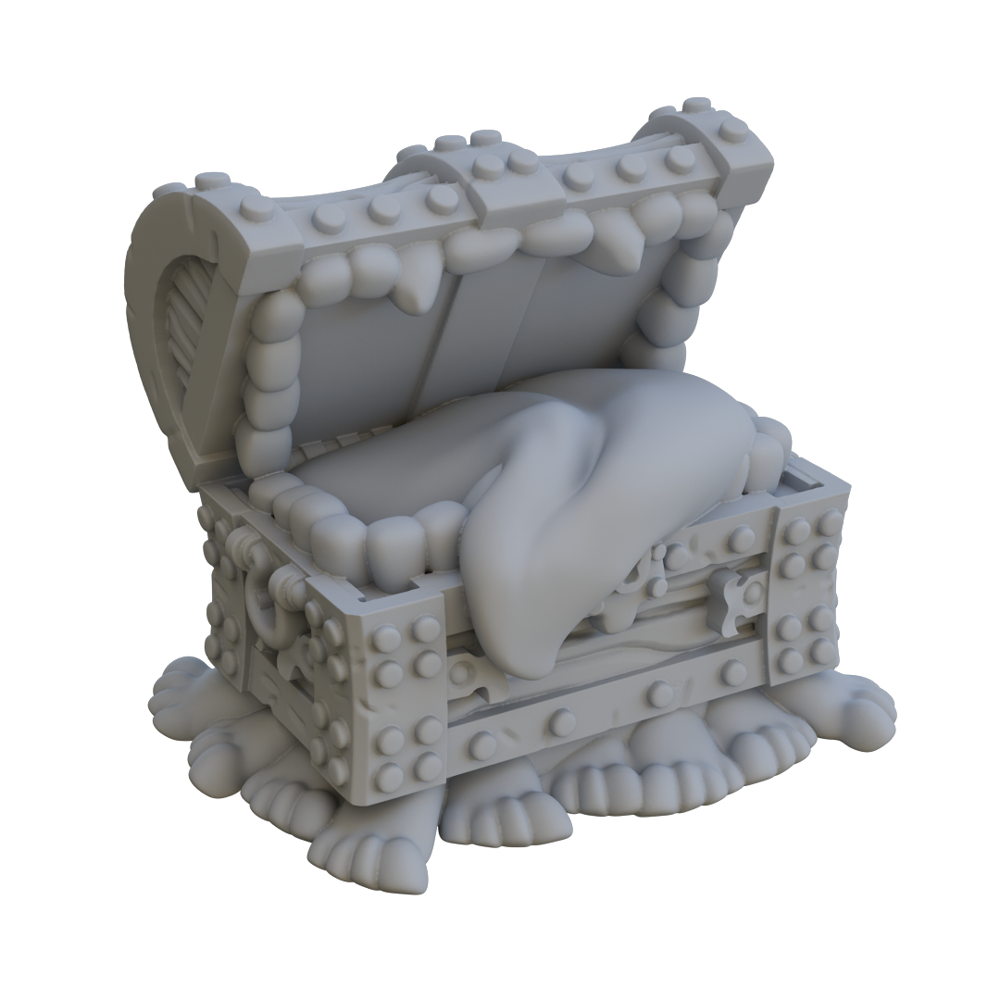
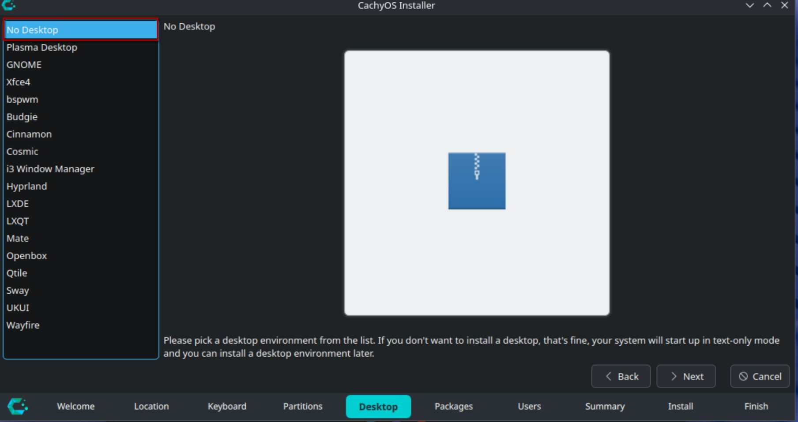
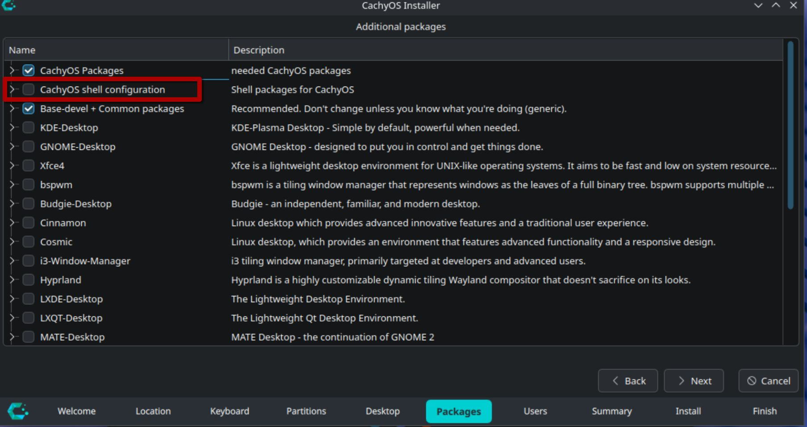

# HyprLuggage 🧳

<div align="center">



**Magical, Multi-Legged Hyprland Setup**

**(Made of Sapient Pearwood)**
**(Fiercely Loyal to Your Dotfiles)**

<a href="#installation"></a>&ensp;
<a href="#themes"></a>&ensp;
<a href="install/themes/README.md"></a>&ensp;
<a href="#usage"></a>&ensp;
<a href="#keybindings"></a>

[](https://archlinux.org/)
[](https://www.cachyos.org/)
[](https://hyprland.org/)
[](LICENSE)

</div>

## Features

- **One-command theming** — Switch entire desktop look with `hyprluggage switch`
- **Dynamic colors** — Matugen extracts palette from any wallpaper
- **11 handcrafted themes** — Dark, cozy, and aesthetic
- **Everything synced** — Terminal, bar, launcher, notifications, apps
- **Rofi menus** — App launcher, emoji picker, clipboard, wallpaper selector, power profiles
- **Dual mode** — Vibe (animations + blur) or Focus (minimal + fast)
- **Music integration** — MPD + RMPC + Cava visualizer

<details>
<summary><b>Dual Mode System</b></summary>

Sometimes you want your desktop to look good. Other times you just need to get work done.

**Vibe Mode**

The default look — animations, blur, transparency, gaps. Makes everything feel smooth and polished.

**Focus Mode**

Strips it all down. No animations, minimal borders, transparency off. Just you and your work.

Toggle between them with `Super + Ctrl + Backspace`

</details>

---

## Themes

- **Dynamic** - Colors generated from wallpaper using Matugen
- **Espresso**
- **Forest**
- **Gruvbox Material**
- **Kanagawa**
- **Nordic**
- **Rosé Pine**
- **Sakura**
- **Tokyo Night**
- **Void**
- **Zen**

---

## Rofi & Notifications

**Rofi Menus** - Rofi provides several menus including app launcher, emoji picker, clipboard, wallpaper selector, and power profiles.

---

## Hyprlock

Lock screen with customizable appearance.

---

## Neovim

Neovim configuration with theme integration.

---

## Music

Music integration with MPD, RMPC, and Cava visualizer.

---

## Pre-install

This setup works best on **CachyOS** or **Arch Linux**. While CachyOS is preferred, you can use either distribution.

### Installation Steps

1. **Bootloader and Filesystem**
   
   You can use whatever bootloader (GRUB, systemd-boot, rEFInd, etc.) and filesystem (ext4, btrfs, zfs, etc.) you prefer. HyprLuggage works with any combination.

2. **Choose "No Desktop"** during installation
   
   When installing CachyOS, select "No Desktop" from the desktop environment list. This ensures a clean base system without any desktop environment pre-configured.

   

3. **Uncheck "CachyOS shell configuration"** in the packages step
   
   In the packages selection screen, make sure to **uncheck** "CachyOS shell configuration" to prevent the installer from configuring your shell. This allows HyprLuggage to set up your shell configuration instead.

   

---

## Installation

```bash
curl -fsSL https://raw.githubusercontent.com/Jmartgraphix/hyprluggage/main/boot.sh | bash
```

Or manually:

```bash
git clone https://github.com/Jmartgraphix/hyprluggage ~/hyprluggage
cd ~/hyprluggage && ./install.sh
```

### Themes Only

Want just the themes without the full setup? See [install/themes/README.md](install/themes/README.md)

---

## Usage

### Theme Switching

```bash
hyprluggage switch          # interactive picker
hyprluggage switch sakura   # direct switch
hyprluggage list            # show all themes
hyprluggage reload          # re-apply current
```

Or press `Super + Ctrl + Shift + Space` for the theme picker.

<a id="keybindings"></a>

### Keybindings

<details>
<summary><b>Applications</b></summary>

| Key | Action |
|-----|--------|
| `Super + Return` | Terminal |
| `Super + B` | Browser |
| `Super + E` | File Manager |
| `Super + M` | Spotify |
| `Super + D` | Discord |
| `Super + O` | Obsidian |
| `Super + C` | VS Code |
| `Alt + M` | RMPC |
| `Alt + N` | Neovim |
| `Alt + Q` | Yazi |
| `Alt + /` | Btop |

</details>

<details>
<summary><b>Rofi Menus</b></summary>

| Key | Action |
|-----|--------|
| `Super + Space` | App Launcher |
| `Alt + ,` | Clipboard |
| `Alt + .` | Emoji Picker |
| `Super + Ctrl + B` | Power Profiles |
| `Super + Ctrl + Space` | Matugen Theme |
| `Super + Alt + Space` | Wallpaper Picker |
| `Super + Ctrl + Shift + Space` | Theme Switcher |

</details>

<details>
<summary><b>Window Management</b></summary>

| Key | Action |
|-----|--------|
| `Super + Q` | Close Window |
| `Super + K` | Kill Application |
| `Super + Arrow` | Move Focus |
| `Super + Shift + Arrow` | Move Window |
| `Super + Ctrl + Arrow` | Resize Window |
| `Super + 1-9` | Switch Workspace |
| `Super + Shift + 1-9` | Move to Workspace |
| `Super + F` | Fullscreen |
| `Super + V` | Toggle Floating |
| `Super + Shift + O` | Pop Window (Float & Pin) |

</details>

<details>
<summary><b>System</b></summary>

| Key | Action |
|-----|--------|
| `Super + L` | Screensaver |
| `Super + Shift + L` | Lock Screen |
| `Super + Escape` | Power Menu |
| `Super + N` | Notifications |
| `Super + Backspace` | Toggle Transparency |
| `Super + Ctrl + Backspace` | Toggle Focus/Vibe Mode |

</details>

<details>
<summary><b>Screenshots & Recording</b></summary>

| Key | Action |
|-----|--------|
| `Super + P` | Screenshot |
| `Super + R` | Screen Record |
| `Super + Shift + R` | Record with Mic |
| `Super + Shift + P` | Color Picker |

</details>

<details>
<summary><b>Wallpapers</b></summary>

| Key | Action |
|-----|--------|
| `Ctrl + Alt + Space` | Random Wallpaper + Colors |
| `Super + Alt + Left/Right` | Cycle Wallpapers |

</details>

See [.config/hypr/bindings.conf](.config/hypr/bindings.conf) for full list.

---

## Components

| Component | Tool |
|-----------|------|
| Compositor | [Hyprland](https://hyprland.org/) |
| Bar | [Waybar](https://github.com/Alexays/Waybar) |
| Launcher | [Rofi](https://github.com/lbonn/rofi) |
| Terminal | [Kitty](https://sw.kovidgoyal.net/kitty/) / [Ghostty](https://ghostty.org/) |
| Notifications | [Mako](https://github.com/emersion/mako) |
| Lock screen | [Hyprlock](https://github.com/hyprwm/hyprlock) |
| Theme engine | [Matugen](https://github.com/InioX/matugen) |
| Music | [MPD](https://musicpd.org/) + [RMPC](https://github.com/mierak/rmpc) |
| Visualizer | [Cava](https://github.com/karlstav/cava) |
| Editor | [Neovim](https://neovim.io/) |
| Shell | [Fish](https://fishshell.com/) + [Starship](https://starship.rs/) |

---

## Structure

```
~/hyprluggage/
├── .config/
│   ├── hypr/           # Hyprland (compositor, bindings, animations)
│   ├── waybar/         # Status bar
│   ├── rofi/           # Launcher & menus
│   ├── mako/           # Notifications
│   ├── kitty/          # Terminal
│   ├── ghostty/        # Terminal (alt)
│   ├── alacritty/      # Terminal (alt)
│   ├── nvim/           # Neovim
│   ├── fish/           # Shell
│   ├── tmux/           # Terminal multiplexer
│   ├── yazi/           # File manager
│   ├── btop/           # System monitor
│   ├── rmpc/           # Music player
│   ├── matugen/        # Theme generator templates
│   └── lazygit/        # Git UI
├── themes/             # Theme configs (colors, wallpapers)
├── scripts/            # Utility scripts
└── install/            # Installer
    ├── packages.sh     # Package lists
    ├── stow.sh         # Dotfile deployment
    ├── services.sh     # Systemd services
    └── themes/         # Hyprluggage theme system
```

---

## Credits

Learned a lot from these projects:
- [vyrx-dev/dotfiles](https://github.com/vyrx-dev/dotfiles)
- [basecamp/omarchy](https://github.com/basecamp/omarchy)

Wallpapers: [Jmartgraphix/Wallpapers](https://github.com/Jmartgraphix/Wallpapers)

---

<div align="center">

**[Report Bug](https://github.com/Jmartgraphix/hyprluggage/issues/new?template=bug_report.yml)** · **[Request Feature](https://github.com/Jmartgraphix/hyprluggage/issues/new?template=feature_request.yml)** ·

</div>
